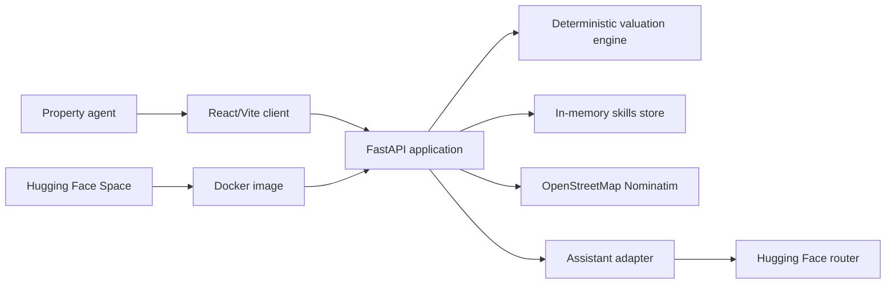

# Property Valuation Agent

A transparent property valuation workspace with a FastAPI backend and React/Vite client.

## Architecture

The project is deployed as one Docker container. FastAPI serves both the JSON API and the compiled React single-page application, so the production deployment does not need a separate frontend host.



### Frontend

- `client/src/App.tsx` defines the two routes: the valuation desk and agent skills.
- `client/src/pages/ValuationDesk.tsx` handles address lookup, valuation input, results, and assistant questions.
- `client/src/pages/AgentSkills.tsx` manages skill creation, editing, enabling, pausing, and deletion.
- `client/src/lib/api.ts` is the typed HTTP client for the backend.
- React Query manages request, loading, error, and mutation state.

### Backend

- `server/main.py` defines the FastAPI routes and serves `client/dist` in production.
- `server/schemas.py` defines the camelCase request and response contracts shared with the frontend.
- `server/valuation.py` calculates the estimate, range, confidence, and transparent breakdown without an external service.
- `server/geocode.py` calls Nominatim and keeps a bounded in-process cache of recent lookups.
- `server/skills.py` stores enabled instructions in memory.
- `server/assistant.py` builds the system prompt from enabled skills and calls the OpenAI-compatible Hugging Face router asynchronously.
- `server/config.py` reads runtime configuration from environment variables.

### Main request flows

1. **Valuation:** the client submits property inputs to `POST /api/valuations`; the deterministic engine returns the estimate immediately.
2. **Property lookup:** the client calls `GET /api/properties/lookup?query=...`; the backend queries Nominatim, caches the result, and returns coordinates and address context.
3. **Assistant:** the client sends `POST /api/assistant/respond` with the question and optional valuation JSON; enabled skills are folded into the system prompt before the Hugging Face request.
4. **Skills:** the client uses `GET`, `POST`, `PATCH`, and `DELETE /api/skills` to manage the assistant instructions.

### API surface

| Method | Endpoint | Purpose |
| --- | --- | --- |
| `GET` | `/api/health` | Runtime and assistant configuration health check |
| `GET` | `/api/properties/lookup` | Geocode an address or place |
| `POST` | `/api/valuations` | Calculate a deterministic valuation |
| `GET` | `/api/skills` | List skills |
| `POST` | `/api/skills` | Create a skill |
| `PATCH` | `/api/skills/{skill_id}` | Update a skill |
| `DELETE` | `/api/skills/{skill_id}` | Delete a skill |
| `POST` | `/api/assistant/respond` | Ask the optional assistant |

### Runtime characteristics

- Valuations are deterministic and work without an inference token.
- Assistant and geocoding calls are asynchronous because they wait on external HTTP services.
- Skills and geocoding cache data are process-local. They reset when the container restarts or scales to another instance.
- The assistant never presents its output as a formal appraisal; the deterministic result is the primary calculation.
- API validation errors are returned using the application error envelope: `{ "error": "..." }`.

## Local development

```powershell
.\.venv\Scripts\python.exe -m pytest -q
cd client
npm run build
cd ..
.\.venv\Scripts\python.exe -m uvicorn server.main:app --reload --port 7860
```

Open `http://127.0.0.1:7860` after building the client.

## Configuration

- `REPLIT_TOKEN` or `HF_TOKEN`: optional Hugging Face inference token
- `MODEL_ID`: optional inference model override
- `HF_ROUTER_URL`: optional Hugging Face router URL override
- `GEOCODER_USER_AGENT`: optional identifying Nominatim user agent
- `REQUEST_TIMEOUT`: external request timeout in seconds; defaults to `60`

The valuation engine is deterministic and does not require an inference token.

For Hugging Face Spaces, configure the inference token as a Space secret named `REPLIT_TOKEN`. The secret is read at process startup and is never committed to the repository.

## Deployment

The root `Dockerfile` uses a two-stage build:

1. Node 20 installs the client dependencies and creates `client/dist`.
2. Python 3.12 installs the backend dependencies and copies the compiled client.
3. Uvicorn serves the application on port `7860`.

The current public deployments are:

- GitHub: https://github.com/tanmoycuat/property-valuation-agent
- Hugging Face Space: https://huggingface.co/spaces/tanmoycuat/property-valuation-agent
